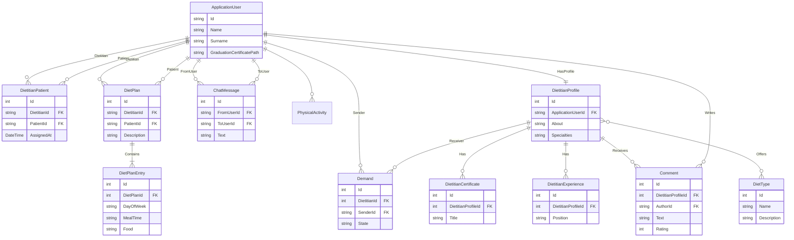

Harika bir proje olmuş\! İzzet ile birlikte güzel bir iş çıkarmışsınız. GitHub'da paylaşmanız için aşağıda detaylı bir README.md dosyası hazırladım. Bu dosyayı kopyalayıp doğrudan projenizin ana dizinine `README.md` olarak ekleyebilirsiniz.

-----

# DietApp Mobil Diyet ve Beslenme Takip Uygulaması

Bu proje, diyetisyenler ve danışanları bir araya getiren, kişiselleştirilmiş diyet planları oluşturulmasına, takibine ve anlık iletişime olanak tanıyan bir mobil uygulamadır. .NET Core Web API ve React Native (Expo) kullanılarak geliştirilmiştir.

## ✨ Projenin Amacı

  * **Diyetisyenler İçin:** Danışanlarını kolayca yönetebilecekleri, onlara özel diyet listeleri hazırlayabilecekleri, gelişimlerini takip edebilecekleri ve onlarla anlık olarak iletişim kurabilecekleri bir platform sunmak.
  * **Danışanlar İçin:** Diyetisyenleriyle kolayca iletişim kurabilecekleri, diyet listelerine anında erişebilecekleri, vücut ölçümlerini ve ilerlemelerini kaydedebilecekleri ve motivasyonlarını yüksek tutacak özelliklerden faydalanabilecekleri bir mobil uygulama sağlamak.

## 🚀 Teknolojiler ve Mimari

Proje, modern ve ölçeklenebilir teknolojiler kullanılarak **Client-Server** mimarisiyle geliştirilmiştir.

### Backend (Sunucu Tarafı) - `DietTracking.API`

  * **.NET 9:** Güçlü ve performanslı backend altyapısı.
  * **ASP.NET Core Web API:** RESTful API servisleri için kullanılmıştır.
  * **Entity Framework Core:** Veritabanı işlemleri için kullanılan ORM (Object-Relational Mapping) aracıdır.
  * **SQLite:** Geliştirme ortamı için hafif ve sunucusuz bir veritabanı motoru.
  * **ASP.NET Core Identity:** Kullanıcı kimlik doğrulama ve yetkilendirme işlemleri için.
  * **JWT (JSON Web Tokens):** Güvenli API iletişimi için token tabanlı kimlik doğrulama.
  * **SignalR:** Diyetisyen ve danışan arasında anlık mesajlaşma (chat) özelliği için gerçek zamanlı iletişim kütüphanesi.
  * **FluentValidation:** Modellerin sunucu tarafında doğrulanması için kullanılmıştır.
  * **Swagger:** API endpoint'lerinin dokümantasyonu ve testi için.

### Frontend (İstemci Tarafı) - `DietAppClient`

  * **React Native:** iOS ve Android için cross-platform mobil uygulama geliştirmeyi sağlar.
  * **Expo:** React Native uygulama geliştirme sürecini basitleştiren bir framework ve platform.
  * **React Navigation:** Uygulama içi ekran geçişleri ve navigasyon yönetimi için.
  * **Axios:** Backend API'si ile iletişim kurmak için kullanılan HTTP istemcisi.
  * **AsyncStorage:** Cihaz üzerinde veri saklamak için.
  * **Expo Notifications:** Anlık bildirimler göndermek için.

## 🔧 Kurulum ve Çalıştırma

Projeyi yerel makinenizde çalıştırmak için aşağıdaki adımları izleyebilirsiniz.

### 1\. Backend Kurulumu (`DietTracking.API`)

Öncelikle `.NET 9 SDK`'nın yüklü olduğundan emin olun.

1.  **Repository'yi Klonlayın:**

    ```bash
    git clone <repository-url>
    cd DietAppMobil-38e14c0710a55204b6cc14d911e816586df41043/DietTracking.API
    ```

2.  **Gerekli Paketleri Yükleyin:**

    ```bash
    dotnet restore
    ```

3.  **Veritabanını Oluşturun:**
    Proje Entity Framework Core Migrations kullandığı için, veritabanı ilk çalıştırmada otomatik olarak oluşturulacaktır (`dietapp.db`). Dilerseniz aşağıdaki komutla manuel olarak da veritabanını güncelleyebilirsiniz:

    ```bash
    dotnet ef database update
    ```

4.  **Uygulamayı Çalıştırın:**

    ```bash
    dotnet run
    ```

    API, `https://localhost:PORT` ve `http://localhost:PORT` adreslerinde çalışmaya başlayacaktır. Swagger arayüzüne `https://localhost:PORT/index.html` adresinden ulaşabilirsiniz.

### 2\. Frontend Kurulumu (`DietAppClient`)

Öncelikle `Node.js`, `npm` ve `Expo CLI`'ın yüklü olduğundan emin olun.

1.  **Dizine Gidin:**

    ```bash
    cd ../DietAppClient
    ```

2.  **Gerekli Paketleri Yükleyin:**

    ```bash
    npm install
    ```

3.  **API Adresini Yapılandırın:**
    `DietAppClient/api.js` dosyasını açın ve `baseURL` değişkenini çalışan backend API adresinizle güncelleyin.

    ```javascript
    const instance = axios.create({
      baseURL: 'http://<YEREL_IP_ADRESINIZ>:<API_PORT>/api', // Örn: 'http://192.168.1.5:5000/api'
    });
    ```

    *Not: Mobil cihazınızın ve bilgisayarınızın aynı ağda olduğundan emin olun.*

4.  **Uygulamayı Çalıştırın:**

    ```bash
    npm start
    ```

    Expo Geliştirici Araçları açılacaktır. Buradan QR kodu okutarak uygulamayı Expo Go uygulaması ile telefonunuzda çalıştırabilir veya bir emülatör üzerinde başlatabilirsiniz.

## 📊 Veritabanı Modelleri ve İlişkileri

Uygulamanın veritabanı yapısı, kullanıcılar, diyetisyenler, danışanlar, diyet planları ve aralarındaki ilişkileri içerecek şekilde tasarlanmıştır.

### Ana Tablolar

  * **ApplicationUser:** ASP.NET Core Identity'den türetilmiş, hem diyetisyen hem de danışanların temel bilgilerini tutan kullanıcı tablosu. Ek olarak `Name`, `Surname`, `GraduationCertificatePath` gibi alanlar içerir.
  * **DietitianProfile:** Diyetisyenlerin detaylı profil bilgilerini (hakkında, uzmanlık alanları, çalışma saatleri vb.) tutar. `ApplicationUser` ile bire-bir ilişkilidir.
  * **DietitianPatient:** Bir diyetisyenin hangi danışanlara atandığını gösteren ilişki tablosu.
  * **DietPlan:** Diyetisyen tarafından bir danışan için oluşturulan diyet planının ana bilgilerini içerir.
  * **DietPlanEntry:** Bir diyet planının öğünler, saatler ve yiyecekler gibi detaylı girdilerini tutar.
  * **ChatMessage:** Diyetisyen ve danışan arasındaki anlık mesajlaşma kayıtlarını saklar.
  * **Demand:** Danışanların diyetisyenlere danışmanlık talebi gönderdiği ve diyetisyenlerin bu talepleri yönettiği tablo.

### Diğer Yardımcı Tablolar

  * **PersonalInfo, PhysicalActivity, Lifestyle, FoodHabit, Goal, MedicalHistory, TestResult:** Danışanların anamnez formunda doldurduğu detaylı bilgileri tutan tablolar.
  * **BodyMeasurement, WeightMeasurement:** Danışanların vücut ve kilo ölçüm kayıtları.
  * **DietitianCertificate, DietitianExperience:** Diyetisyenlerin sertifika ve deneyim bilgileri.
  * **Comment:** Danışanların diyetisyenlere yaptığı yorum ve değerlendirmeler.
  * **DietType:** Sistemde tanımlı olan diyet türleri (Ketojenik, Akdeniz vb.).

### Mermaid ERD (Entity Relationship Diagram)

Aşağıdaki Mermaid kodu, veritabanı tabloları arasındaki ilişkileri görselleştirmektedir.



-----
